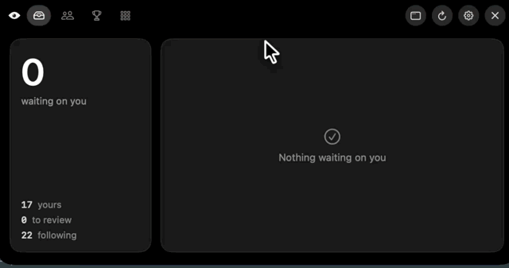

<div align="center">


# Diple

**The pull requests waiting on you, one glance away.**

Lives in the MacBook notch. Stays invisible while there is nothing to do.
Tells you when someone replies to you on a line of code — and lets you
answer without opening anything.


<br /><br />

<!-- DEMO — 20-30s of the notch opening, a notification arriving, a reply sent.
     Record it, open any GitHub issue, drag the file into the comment box, copy
     the https://github.com/user-attachments/assets/… URL it hands back, then
     delete these comment markers and paste it below.


-->

</div>

---

## Why

Most review tools are a second inbox: everything is equally loud, nothing tells
you what is actually waiting on you, and setting them up is its own afternoon.

Diple takes one position — **a review queue is a list of obligations, not a
list of events**. If nobody is waiting on you, it shows nothing. When somebody
is, it grows out of the bezel and says who, where, and why.

---

## What it does

### The notch is the app

Nothing waiting: an eye and a dimmed zero, sitting inside the bezel. Something
waiting: the count lights up. Hover and it opens — four tabs, the queue, your
team, the ranking, your streak.

<!-- hover open/close, 8s loop


-->

### Answer without leaving what you are doing

When someone replies to you on a line of code, the banner carries the reply box
and a Resolve button. You answer from the notification; the thread updates on
GitHub.

<!-- notification arriving → typing a reply → thread resolved


-->

### A different sound per kind of event

Glass when someone replied to you. Pop for a comment. Purr for a review
request. Basso when a check breaks. Approvals arrive silently. You learn what
happened before you look.

<!-- settings screen, pressing the test buttons


-->

### Review with your own Claude

Diple has no AI of its own. It drives **your** Claude Code session, with your
skills and your repository's CLAUDE.md, in a throwaway worktree. The findings
come back anchored to the diff as drafts.

Nothing is published, and that is structural rather than a promise:

```
--allowed-tools     Read Grep Glob Bash(git diff|log|show|status)
--disallowed-tools  Write Edit Bash(gh) Bash(git push) Bash(git commit) WebFetch
```

It does not choose not to publish. It cannot.

<!-- pressing Review with AI → live progress → findings in the margin


-->

### A map before you start reading

What the PR changes comes from the diff. What it does not change but will feel
comes from reference search. Only the expensive question — *what would someone
need to know to judge this, that is not here* — goes to the model.

<!-- the PR map, connected boxes


-->

### Every repository you belong to

Grouped by organisation, searchable, each one opening its own list of open pull
requests split into Ready and Draft. Star any of them to watch it.

<!-- sidebar, picking a repo, ready/draft tabs


-->

### Your rhythm

A ranking over the last week, month or quarter — you and the people you follow,
not the whole company. A contribution grid of the days you reviewed, and the
streak, with your own bar catching fire when it fills.



---

## Install

Requires **macOS 14+**, **Xcode 16+** and the [GitHub CLI](https://cli.github.com)
already signed in (`gh auth login`). Diple borrows that token — there is no
setup screen and nothing to paste.

```bash
git clone https://github.com/chagas42/diple.git
cd diple
make install
```

That builds, signs, copies to `/Applications` and prints where it found each
tool it needs.

> **The app is signed ad-hoc.** On a machine that did not build it, macOS will
> refuse to open it the first time: right-click → Open, or
> `xattr -dr com.apple.quarantine /Applications/Diple.app`. Notarising needs a
> paid Apple Developer account, which this does not have.

---

## Development

```bash
make run        # build, bundle, launch — the fast loop
make install    # /Applications; use this when testing notifications
make tools      # show which binaries were found, and where
make probe      # print the queue in the terminal, no UI
make stop
```

No `.xcodeproj`. The whole project is Swift Package Manager plus a Makefile
that assembles and signs the bundle, so everything is plain text.

---

## How it is built

| | |
|---|---|
| UI | SwiftUI, with AppKit for the panel and the windows |
| Notch | `NSPanel`, non-activating, `.statusBar` level, `.fullScreenAuxiliary` |
| Data | One aggregated GraphQL query, 1 point per sync |
| Storage | A versioned JSON file in Application Support |
| Auth | The token `gh` already holds |
| AI | Your `claude` binary, `--output-format stream-json` |
| Dependencies | None |

`NOTES.md` carries the API traps this cost real time to find — `reviewThreads`
being a separate channel from `comments`, `baseRefOid` versus a stale
`origin/HEAD`, why a GUI app cannot see your `PATH`.

---

## Not there yet

- [ ] Device flow, so `gh` is not required
- [ ] Watched repositories feeding new PRs into the queue
- [ ] Rate-limit state when your Claude plan runs out mid-review
- [ ] Sound for the streak animation, behind a switch
- [ ] A license file — pick one before this goes public

---

## The name

*Diple* (διπλῆ, "double") is the mark `⟩` that scholars at the Library of
Alexandria drew in the margin of a manuscript to say **look at this line**.
Aristarchus used it alongside the obelus † for a suspect line and the asterisk ※
for a duplicate — the first formal system of review marks we know of, third
century BC. Our quotation marks descend from it.

The app does the same job: it points, in the margin, at what deserves your
attention.

---

## Credits

The notch window architecture — a fixed-size panel with the shape animating
inside it, rather than resizing the window — was learned by reading
[boring.notch](https://github.com/TheBoredTeam/boring.notch).
