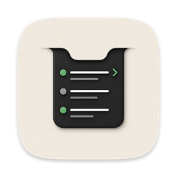
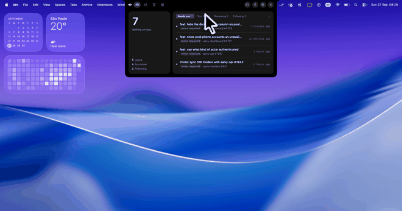

<div align="center">



# Diple

**The pull requests waiting on you, one glance away.**

Lives in the MacBook notch. Stays invisible while there is nothing to do.
Tells you when someone replies to you on a line of code — and lets you
answer without opening anything.


<br /><br />



</div>

---

## Why

Most review tools are a second inbox: everything is equally loud, nothing tells
you what is actually waiting on you, and setting them up is its own afternoon.

Diple takes one position — **a review queue is a list of obligations, not a
list of events**. If nobody is waiting on you, it shows nothing. When somebody
is, it grows out of the bezel and says who, where, and why.

---

## What it does

**The notch is the app.** Nothing waiting: an eye and a dimmed zero, sitting
inside the bezel. Something waiting: the count lights up. Hover and it opens —
the queue, your team, the ranking, your streak. On a Mac without a notch the
same panel floats under the menu bar.

**Answer without leaving what you are doing.** When someone replies to you on a
line of code, the banner carries the reply box and a Resolve button. You answer
from the notification; the thread updates on GitHub.

**A different sound per kind of event.** Glass when someone replied to you. Pop
for a comment. Purr for a review request. Basso when a check breaks. Approvals
arrive silently. You learn what happened before you look.

**Obligations only.** The queue holds reviews someone asked of you and replies
waiting on your answer. Your own PR shows up only when somebody actually
replied to you on it — a broken check is status, not review work, so it stays
in Your PRs and raises a notification instead.

**Stacks stay stacks.** Dependent branches are grouped, numbered, and labelled
bottom to top, because the order is the information.

**Every repository you belong to.** Grouped by organisation, searchable, each
one opening its own list of open pull requests split into Ready and Draft. Star
any of them to watch it.

**Your rhythm.** A ranking over the last week, month or quarter — you and the
people you follow, not the whole company. A contribution grid of the days you
reviewed, and the streak.

---

## Review with your own Claude

Diple has no AI of its own. It drives **your** Claude Code session, with your
skills and your repository's CLAUDE.md, in a throwaway worktree. The findings
come back anchored to the diff as drafts.

Nothing is published, and that is structural rather than a promise:

```
--allowed-tools     Read Grep Glob Bash(git diff|log|show|status)
--disallowed-tools  Write Edit Bash(gh) Bash(git push) Bash(git commit) WebFetch
```

It does not choose not to publish. It cannot.

Before the findings there is a map: what the PR changes comes from the diff,
what it does not change but will feel comes from reference search, and only the
expensive question — *what would someone need to know to judge this, that is
not here* — goes to the model.

---

## Install

### One line

```bash
curl -fsSL https://raw.githubusercontent.com/chagas42/diple/main/install.sh | bash
```

Downloads the latest release, checks its checksum, puts it in `/Applications`
and opens it. No security dialog — [read the script](install.sh) first if you
like, it is short.

Needs **macOS 14+** and the [GitHub CLI](https://cli.github.com) signed in
(`gh auth login`); Diple borrows that token, so there is nothing to paste.

### Why not just download the .zip?

You can, but macOS will greet you with this:

> *"Diple" Not Opened — Apple could not verify "Diple" is free of malware…*
> **Move to Trash** · Done

Diple is not malware, and macOS is not wrong to be suspicious either. The build
is signed ad-hoc, not notarised: notarising needs a paid Apple Developer
account, which this project does not have, and macOS cannot tell an ad-hoc
signature from anything else it has never seen.

The check only fires on files your browser marked as downloaded (the
`com.apple.quarantine` flag). `curl` does not set that flag, which is why the
script above never trips it. If you already downloaded the zip, either clear
the flag:

```bash
xattr -dr com.apple.quarantine /Applications/Diple.app
```

or press **Done**, open **System Settings → Privacy & Security**, scroll to
*"Diple" was blocked* and click **Open Anyway**. You only do this once.

### Homebrew

```bash
brew install --cask chagas42/tap/diple
```

Homebrew marks its downloads too, but the cask clears the flag after installing,
so there is no dialog here either.

### From source

Requires **macOS 14+**, **Xcode 26+** and the [GitHub CLI](https://cli.github.com)
already signed in (`gh auth login`). Diple borrows that token — there is no
setup screen and nothing to paste.

```bash
git clone https://github.com/chagas42/diple.git
cd diple
make install FLAVOR=release
```

That builds, signs, copies to `/Applications` and prints where it found each
tool it needs.

Nothing was downloaded, so there is no quarantine flag and no dialog. Copy that
`.app` to another Mac, though, and it gets the same treatment as the zip.

## Privacy

Diple sends anonymous usage counts to PostHog so we can tell how many people
use it and which features earn their place. It is on by default and off in one
click: **Settings → Privacy**, or `DO_NOT_TRACK=1` in your environment. Builds
you make yourself have no analytics key and send nothing.

What is sent:

- a random id for your install, which you can reset
- app version, macOS version, whether the screen has a notch
- that the app was used today, with the size of your queue as plain numbers
- when an AI review or a map starts and finishes: outcome, finding count, a duration range
- that you replied, resolved a thread, posted a finding or opened a pull request
- which kind of notification was shown
- when something fails: which step (a sync, a reply, a map…), the error's type, numeric code and name, the kind of network (Wi-Fi, wired, cellular) and whether macOS saw it online, how many failed in a row and roughly how long since the last good sync — never its message
- when GitHub times out and Diple tries again, or checks that a comment went through: the status, the kind of request and whether it worked

What is never sent: your GitHub login, name or e-mail; repository names, pull
request numbers or titles; code, diffs, comments or file paths; your location. Events carry
no person profile, and every event asks PostHog to skip IP geolocation, so
no city, region or coordinates are attached to it.

## Development

```bash
make run        # build, bundle, launch — the fast loop
make install    # /Applications/Diple (Dev).app; use this when testing notifications
make tools      # show which binaries were found, and where
make probe      # print the queue in the terminal, no UI
make film       # run a scripted take over the demo fixtures
make stop
```

`--demo` serves fixtures instead of GitHub, so the app can be demonstrated with
a queue in it. `--alert <kind>` fires one notification and exits:

```bash
open "/Applications/Diple (Dev).app" --args --demo
"/Applications/Diple (Dev).app/Contents/MacOS/Diple" --alert repliedToYou
```

What `make` builds is named **Diple (Dev)**, so it can sit next to a released
Diple and still be told apart. `FLAVOR=release` builds plain **Diple**.

No `.xcodeproj`. The whole project is Swift Package Manager plus a Makefile
that assembles and signs the bundle, so everything is plain text.

---

## How it is built

| | |
|---|---|
| UI | SwiftUI, with AppKit for the panel and the windows |
| Notch | `NSPanel`, non-activating, `.statusBar` level, `.fullScreenAuxiliary` |
| Data | One aggregated GraphQL query, 1 point per sync |
| Storage | A versioned JSON file in Application Support |
| Auth | The token `gh` already holds |
| AI | Your `claude` binary, `--output-format stream-json` |
| Dependencies | None |

`NOTES.md` carries the API traps this cost real time to find — `reviewThreads`
being a separate channel from `comments`, `baseRefOid` versus a stale
`origin/HEAD`, why a GUI app cannot see your `PATH`.

---

## Not there yet

- [ ] Device flow, so `gh` is not required
- [ ] Watched repositories feeding new PRs into the queue
- [ ] Rate-limit state when your Claude plan runs out mid-review
- [ ] Notarised builds, so the zip and Homebrew open without the security dialog

---

## The name

*Diple* (διπλῆ, "double") is the mark `⟩` that scholars at the Library of
Alexandria drew in the margin of a manuscript to say **look at this line**.
Aristarchus used it alongside the obelus † for a suspect line and the asterisk ※
for a duplicate — the first formal system of review marks we know of, third
century BC. Our quotation marks descend from it.

The app does the same job: it points, in the margin, at what deserves your
attention.

---

## Contributing

[CONTRIBUTING.md](CONTRIBUTING.md) has the house rules — no dependencies, no
comments in the code, English in the interface, one concern per pull request.
`main` takes pull requests only, and they need a green CI and one approval.

## License

[MIT](LICENSE).
